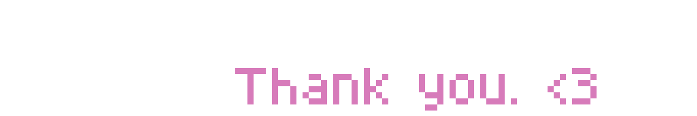

import { Steps, Icon, Badge, Aside, LinkCard, CardGrid } from '@astrojs/starlight/components';

# Credits

## Plugins and tools used

**DE-Whitelist** and **DE-Login** has been developed internally.

<CardGrid>

<LinkCard title="CraftEngine" href="https://www.spigotmc.org/resources/craftengine.120377/" />
<LinkCard title="FancyDialogs" href="https://modrinth.com/plugin/fancydialogs" />
<LinkCard title="FancyNpcs" href="https://modrinth.com/plugin/fancynpcs" />
<LinkCard title="VeinMiner" href="https://modrinth.com/plugin/veinminer" />
<LinkCard title="CoreProtect" href="https://modrinth.com/plugin/coreprotect" />
<LinkCard title="CreeperGuard" href="https://www.spigotmc.org/resources/creeperguard.103953/" />
<LinkCard title="DecentHolograms" href="https://modrinth.com/plugin/decentholograms" />
<LinkCard title="DiscordSRV" href="https://modrinth.com/plugin/discordsrv" />
<LinkCard title="Floodgate" href="https://modrinth.com/plugin/floodgate" />
<LinkCard title="Geyser" href="https://modrinth.com/plugin/geyser" />
<LinkCard title="ImageFrame" href="https://modrinth.com/plugin/imageframe" />
<LinkCard title="LuckPerms" href="https://luckperms.net/" />
<LinkCard title="Multiverse-Core" href="https://modrinth.com/plugin/multiverse-core" />
<LinkCard title="MythicMobs" href="https://www.mythicmobs.net/" />
<LinkCard title="Origins Reborn" href="https://modrinth.com/plugin/origins-reborn" />
<LinkCard title="SkinsRestorer" href="https://skinsrestorer.net/" />
<LinkCard title="Skript" href="https://github.com/SkriptLang/Skript" />
<LinkCard title="TAB" href="https://modrinth.com/plugin/tab-was-taken" />
<LinkCard title="Vault" href="https://github.com/MilkBowl/Vault" />
<LinkCard title="ViaVersion" href="https://modrinth.com/plugin/viaversion" />
<LinkCard title="WorldEdit" href="https://modrinth.com/plugin/worldedit" />
<LinkCard title="WorldGuard" href="https://modrinth.com/plugin/worldguard" />

</CardGrid>

<Aside type="note">
    Total of **30 plugins** — 4 Paper plugins and 26 Bukkit plugins — keeping the server running smoothly!
</Aside>

## Contributor :

**SMP Owner, Lore maker :** @lxnarian

**Developer, Main wiki admin:** @betawolfy

## Wiki contributor :
Those people has helped making the wiki better, by providing feedback, fixing typos, and adding content.

**Wiki testers :**

- @lxnarian
- @.4zeki


## Starlight
The wiki is built using [Starlight](https://astro.build/starlight), an open-source documentation theme for Astro. It provides a clean and modern design, as well as a lot of features that make it easy to create and maintain a documentation website.

# Emotional support

***Houston*** from Astro, forever the best mascot \<3

```ansi
╭─────╮  Houston:
│ ◠ ◡ ◠  Initiating launch sequence... right... now!
╰─────╯
```
