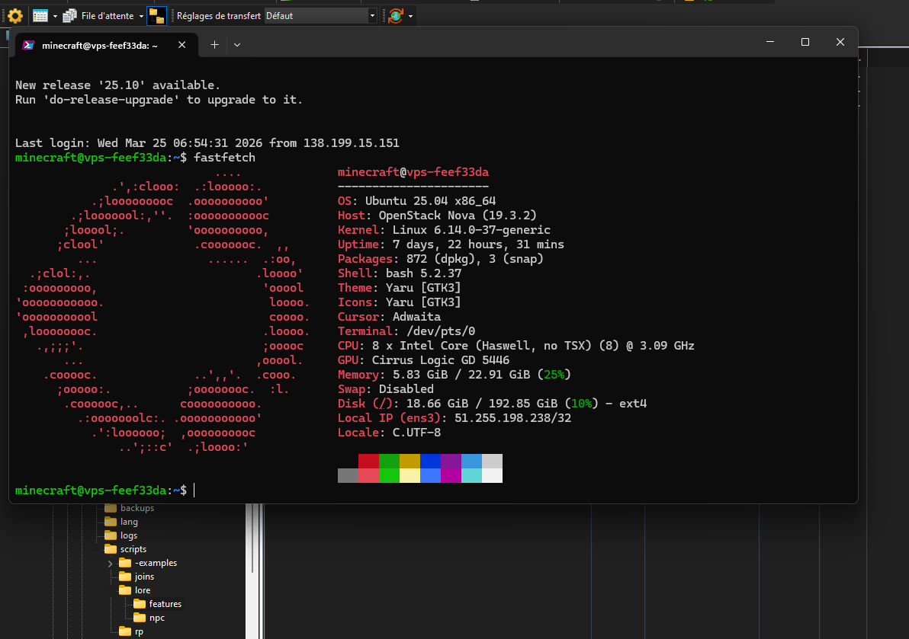

import { Steps, Icon, Badge, Aside, LinkCard, CardGrid } from '@astrojs/starlight/components';

This page contains devlogs of the Distinct Errors mod. It is updated whenever a new devlog is released, and it contains links to all the devlogs released so far.
All version between 1.0 and 2.0 are in the smp announcement channel.

## Changes log: 

### Version 3.0 <Badge text="Latest" variant="tip" />
_March 21st, 2026_

**Machine migration has been done**
Before this migration, the server was running using a 3rd party hosting service. It was cool and pretty, with an interface, but i had no control over the machine, and it was pretty expensive for what it was. 
So i decided to migrate the server to a machine that I control, which is way cheaper and gives me more control over the server.

We have now our own VPS machine, using **Ubuntu**, which i know how to use and manage!


*Our new setup!*

***Other changes:***

- Added a `AFK` plugin.
  - Simply do `/afk` to toggle your AFK status. When you are AFK, you will be marked as AFK in chat, and will not take damage from mobs or other players. You can still move and chat.

- Added various optimization plugins:
    - `Chunky` has been added due to world generation being very slow without it.
    - `Viaversion` to allow newer version to connect to the server, depite the server running on 1.21.11.

- Added a few assets about lore. 
    - :] 

- Added a character intro channel!
    - Added a channel to introduce your character.
    - This is a great way to introduce your character and know who is who in the server.

~~+ Added lore channel~~
We have cancelled this one, as we will provide lore in this wiki.

---

---

### Version 2.1
_March 18th, 2026_

- Added Sanity Plugin
  - Depending of how you feel in lore or other, you can now use the `/howifeel` command to send a message to admins.
  They will then update your mental value.
  - It came to our attention that the hallucination system was a bit too overwhelming, so we made it less stressful by reducing the frequency of hallucinations and making them less intense.

<Aside type="note" title="Note about privacy">
  The only persons that will see your message is @glitch and @betawolfy. All feeling sent are processed out of any lore wise events.
</Aside>

- Updated bedrock parity plugins.
  - This update doesn't bring anything new, but it assures that latest versions can play!

### Version 2.0
_March 11th, 2026_

- Added 21 new origins
    - Bee, Drowned, Evoker, Fox, Slime, Snow golem, Strider, Witch, Wolf, Guardian
    - Creeper, Zombie (Normal, Husk, Drowned), Skeleton, Stray, Warden, Wither Skeleton, Piglin (Normal, Zombified) 

- Added many lore skripts.
- Updated the Bedrock Resource pack.
- Fixed an issue where players could run.
- Added ***"The Damage"***. 
- Added ***"Something"***

### Version 1.[Undefined]
__March 6th, 2026__

- Added ***"The Consequence"***.

- Updated many plugins!
- Added some skripts.

- Removed something/someone. (?)

### Version 1.3 
__March 1st, 2026__

- ~~Added a new /warp plugin~~
    - ~~Added "Spawn" warp~~
    - ~~Added "MobFarm" warp~~
    - ~~Added "GuardianFarm" warp~~
    - ~~Added "IronFarm" warp~~

<Aside type="note" title="Note about warps">
  Those names are outdated due to a plugin changement.
  Though, some of those warps are still available, but they are not named like that anymore.
</Aside>

- Added a Sleep Plugin
    - 25% of the server needs to sleep to skip night.

- Fixed SilentSpeakExploit and an Zero-Day exploit allowing server to talk on it's own.
- Removed Herobrine.

### Version 1.2.1
__February 23rd, 2026__

- Nether is now assessible!
- Blazeborn Origin is now fully usable!

- ~~Added a /warp plugin~~
    - ~~Added "Spawn" warp~~
    - ~~Added "Public_MobFarm" warp~~
*Please open a ticket with coord and name if you wish to add a warp.*
<Aside type="note" title="Note about warps">
  Those names are outdated due to a plugin changement.
  Though, some of those warps are still available, but they are not named like that anymore.
</Aside>

- Remove Default permissions, allowing [server] to talk on it's own.
- Removed Herobrine.

### Version 1.2
__February 22th, 2026__

- Updating Server software!
    - This will be faster!!

-  Added CreeperGuard
    - Removes Creeper explosion damages witthout compromising the rest of the game.

-  Added VeinMiner
    - Allows you to mine an entire ore vein instently instead of minint one by one.

-  Updated Wiki
    - Added 2 methods for bedrock to connect to the SMP
    - Working on a potential v2

- Updated 2 plugins.

- Fixed [server] saying bizzare things
- Removed Herobrine

### Version 1.1
__February 17th, 2026__

- Updating Server software!
    - This will be faster!!
- Added ImageFrame Plugin
- Added CraftEngine
    - Experimentation will be required before giving you access to those.

- Added a Maintenance Plugin
    - Server access will be closed instead of closing the server entirely. 

! Note: I tried my best to make Bedrock experience a bit more plesent. Idk if it will work. Just note i'll always do my best to improve it.

- Removed Herobrine

```

```

## Roadmap:

***Uniting the resources packs*** <Badge text="Added in 3.0" variant="success" />

In **Java**, players has to download **3** resource packs to play on the server:
- The main resource pack, which contains all custom roles.
- The custom items ones, which contains all custom items textures and assets.
- The Origins one, which contains , for exemple, the interfaces and cooldown bars of the Origins mod.

I am currently working on merging the **Main one** and the **custom items one** into a single resource pack, which will reduce the number of resource packs players have to download and manage.

As for **Bedrock** players, I have still not tested the resource packs merging, but I will do it as soon as possible to see if it is possible to merge them without breaking anything.

***New Origins***

I am currently working on adding new Origins to the server, but I don't have any ETA for now.

My current ideas are: 
- **Bunny** Origin, which will have powers related to jumping and speed.
- A **Cyberling** Origin, which will have powers related to technology and hacking.

***Adding more of your ideas:***

I am always open to new ideas for the server, so if you have any, feel free to share them in the discord or in DMs!