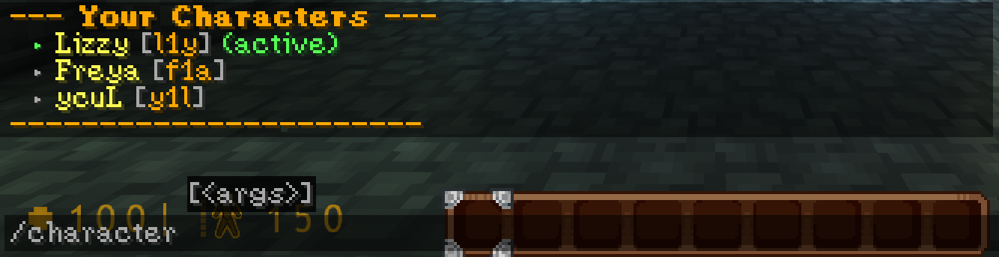
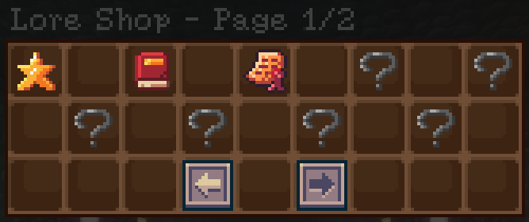
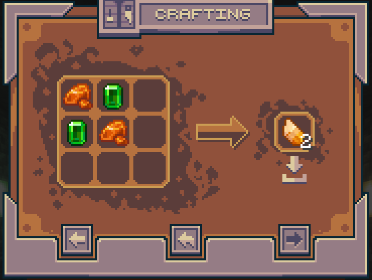

import { Steps, Icon, Badge, Aside, LinkCard, CardGrid } from '@astrojs/starlight/components';

This page contains devlogs of the Distinct Errors mod. It is updated whenever a new devlog is released, and it contains links to all the devlogs released so far.
All version between 1.0 and 2.0 are in the smp announcement channel.

## Changes log: 

## Roadmap:

***Uniting the resources packs*** <Badge text="Added in 3.0" variant="success" />

***New Origins***

I am currently working on adding new Origins to the server, but I don't have any ETA for now.

My current ideas are: 
- **Bunny** Origin, which will have powers related to jumping and speed.
- A **Cyberling** Origin, which will have powers related to technology and hacking.

*** Bedrock experience improvements***

Improving bedrock custom items, etc...

<Aside type="note" title="Update notes">
  All items that doesn't require a 3D model aren't visible for bedrock players, but all others shall be.
</Aside>

*** new rank plates*** <Badge text="Added in 3.3" variant="success" />

***Adding more of your ideas:***

I am always open to new ideas for the server, so if you have any, feel free to share them in the discord or in DMs!

### Version 3.3
_May 2nd, 2026_
<Badge text="Latest" variant="tip" /> <Badge text="VERY big update" variant="caution" />

This update bring a complete rework of the RPChat and it's components, as well as a new rank plates.

#### *RPChat / RP features rework:*

- ***Introducing: `/character` command!***
    - Added `/character add` command.
        - This command allows you to add a character to your profile, which will be used for RPChat.
        - the command usage is `/character add <character name>`, this will create a 3 long character ID, which will be used for RPChat.
    - Added `/character delete` command.
        - This command allows you to completely delete a character from your profile.
        - the command usage is `/character delete <character ID>`, this will delete the character with the specified ID.
    - Added `/character list` command.
        - This command allows you to list all your characters and their IDs.
    - Added `/character edit` command.
        - This command allows you to rename a character from your profile.
        - the command usage is `/character rename <character ID> <new character name>`, this will rename the character with the specified ID to the new name.
    - Added `/character select` command.
        - This command allows you to set your active character, which will be used for RPChat.
        - the command usage is `/character select <character ID>`, this will set the character with the specified ID as your active character.




    <Aside type="note" title="Note about multiple characters RPs">
        Even if `/character select` is prioritized, typing any ID in the first part of your messafe will make you speak as that character, without changing your active character. 
        ***HOWEVER***, it doesn't change the selected character, nor works with /me and /action.
    </Aside>

    - Added `/character clear` command.
        - This command allows you to clear your active character, which will fallback to use your username
        - the command usage is `/character clear`, this will clear your active character.


- Added new RP features:
    - Removed `/roll` and replaced it with `/dice <dice format>`
        - This command allows you to roll a dice with the specified format, which is `NdM`, where N is the number of dice and M is the number of faces of the dice. 
        For example, `2d6` will roll 2 6-faced dice and gives the output [4, 5] (for example) and the total (9 in this case).
    - Added `/action` command.
        - Similar to `/me`, but with a different format. instead of showing the RP name of the player, it just shows the action.
          - It can be used to discribe the ambience, or the ***angst*** that is happening right now.

#### Lore Shop: 

- Lore shop
    - Added a lore shop, which can be accessed with `/loreshop` command.
    - This shop allows you to buy lore items with Topaz!



#### Others: 

- Added a craft for topaz:
    - 2 emeralds + 2 resin clamps = 2 topaz.



- Revemped Mods and Admins rank plates.
- Added a moderation command to moderate the RPChat.

---

### Version 3.2
_April 27th, 2026_
<Badge text="big update" variant="caution" />

This update bring new QoL features for logging, as well as new content for the ones who don't take care of their characters in lore.

#### Content:

- Changes made to the `DE-Sanity` plugin:
    - Added 4 new hallucinations.
        - Special one for DVs coming soon.
    - ⚡ (Supposedly) Fixed a bug where bedrock players would get their sanity reset to 0 when they disconnect from the server.
    - ⭐ Added a test command for staff.

- Changes made to the `DE-Login` plugin:
    - Added IP trusting.
        - You won't be forced to type your password for 2 days.

#### Other changes:
- bedrock parity plugins has been updated, fixing a security issue.

#### Notes regarding Bedrock players:
A small plan has been established to improve Bedrock experience, but it will take some time to be implemented, as it requires a lot of testing and work to be done.

Here is the plan:

1. **Allowing bedrock players to see non-custom model items and blocks:**
    - This one is ***normally*** pretty easy to do, as it doesn't need custom models.

2. **Allowing bedrock players to see custom model items and blocks:**
    - I'm pretty sure it is possible, but all items that needs a custom model will need to be tweaked to work on bedrock.

3. **Creating the tools so bedrock QoL features can be added without breaking anything:**
    - I wanna avoid bedrock players to feel behind, so I will do my best to try to release everything on both java and bedrock at the same time.

At the moment, we are still on step 1, but I will keep you updated on the progress of this plan in the next devlogs!


### Version 3.1
_April 18th, 2026_
<Badge text="Small update" variant="success" />

- Updated Bedrock parity plugins.
    - This update doesn't bring anything new, but it assures that latest versions can play!
    - Console players should now be able to connect to the server without any issue as well!
      - If you cannot, retry a few moment later, for some reason, it rework randomly...

- Updated lots of plugins,
    - Some plugins still needs an update, but updating them breaks other plugins.
        - exemple: the NPC plugin crashing also made the discord bot crash for some reason???

---

- Added a new origin: The "Something" Origin.
- Removed the ability to use the toiley (sorry Kris :c)

### Version 3.0.1 

<Badge text="Small update" variant="success" /> <Badge text="Bedrock" variant="note" />

_March 27th, 2026_

- Bedrock plugins
    - Bedrock parity plugins has been updated!
    - All Bedrock players should now be able to connect to the server without any issue!

- New lore assets
    - Added a new. . . Character (?)

### Version 3.0

<Badge text="Major update" variant="danger" />

_March 21st, 2026_

**Machine migration has been done**
Before this migration, the server was running using a 3rd party hosting service. It was cool and pretty, with an interface, but i had no control over the machine, and it was pretty expensive for what it was. 
So i decided to migrate the server to a machine that I control, which is way cheaper and gives me more control over the server.

We have now our own VPS machine, using **Ubuntu**, which i know how to use and manage!


*Our new setup!*

***Other changes:***

- Added a `AFK` plugin.
  - Simply do `/afk` to toggle your AFK status. When you are AFK, you will be marked as AFK in chat, and will not take damage from mobs or other players. You can still move and chat.

- Added various optimization plugins:
    - `Chunky` has been added due to world generation being very slow without it.
    - `Viaversion` to allow newer version to connect to the server, depite the server running on 1.21.11.

- Added a few assets about lore. 
    - :] 

- Added a character intro channel!
    - Added a channel to introduce your character.
    - This is a great way to introduce your character and know who is who in the server.

~~+ Added lore channel~~
We have cancelled this one, as we will provide lore in this wiki.

---

---

### Version 2.1
_March 18th, 2026_

- Added Sanity Plugin
  - Depending of how you feel in lore or other, you can now use the `/howifeel` command to send a message to admins.
  They will then update your mental value.
  - It came to our attention that the hallucination system was a bit too overwhelming, so we made it less stressful by reducing the frequency of hallucinations and making them less intense.

<Aside type="note" title="Note about privacy">
  The only persons that will see your message is @glitch and @betawolfy. All feeling sent are processed out of any lore wise events.
</Aside>

- Updated bedrock parity plugins.
  - This update doesn't bring anything new, but it assures that latest versions can play!

### Version 2.0
_March 11th, 2026_

- Added 21 new origins
    - Bee, Drowned, Evoker, Fox, Slime, Snow golem, Strider, Witch, Wolf, Guardian
    - Creeper, Zombie (Normal, Husk, Drowned), Skeleton, Stray, Warden, Wither Skeleton, Piglin (Normal, Zombified) 

- Added many lore skripts.
- Updated the Bedrock Resource pack.
- Fixed an issue where players could run.
- Added ***"The Damage"***. 
- Added ***"Something"***

### Version 1.[Undefined]
__March 6th, 2026__

- Added ***"The Consequence"***.

- Updated many plugins!
- Added some skripts.

- Removed something/someone. (?)

### Version 1.3 
__March 1st, 2026__

- ~~Added a new /warp plugin~~
    - ~~Added "Spawn" warp~~
    - ~~Added "MobFarm" warp~~
    - ~~Added "GuardianFarm" warp~~
    - ~~Added "IronFarm" warp~~

<Aside type="note" title="Note about warps">
  Those names are outdated due to a plugin changement.
  Though, some of those warps are still available, but they are not named like that anymore.
</Aside>

- Added a Sleep Plugin
    - 25% of the server needs to sleep to skip night.

- Fixed SilentSpeakExploit and an Zero-Day exploit allowing server to talk on it's own.
- Removed Herobrine.

### Version 1.2.1
__February 23rd, 2026__

- Nether is now assessible!
- Blazeborn Origin is now fully usable!

- ~~Added a /warp plugin~~
    - ~~Added "Spawn" warp~~
    - ~~Added "Public_MobFarm" warp~~
*Please open a ticket with coord and name if you wish to add a warp.*
<Aside type="note" title="Note about warps">
  Those names are outdated due to a plugin changement.
  Though, some of those warps are still available, but they are not named like that anymore.
</Aside>

- Remove Default permissions, allowing [server] to talk on it's own.
- Removed Herobrine.

### Version 1.2
__February 22th, 2026__

- Updating Server software!
    - This will be faster!!

-  Added CreeperGuard
    - Removes Creeper explosion damages witthout compromising the rest of the game.

-  Added VeinMiner
    - Allows you to mine an entire ore vein instently instead of minint one by one.

-  Updated Wiki
    - Added 2 methods for bedrock to connect to the SMP
    - Working on a potential v2

- Updated 2 plugins.

- Fixed [server] saying bizzare things
- Removed Herobrine

### Version 1.1
__February 17th, 2026__

- Updating Server software!
    - This will be faster!!
- Added ImageFrame Plugin
- Added CraftEngine
    - Experimentation will be required before giving you access to those.

- Added a Maintenance Plugin
    - Server access will be closed instead of closing the server entirely. 

! Note: I tried my best to make Bedrock experience a bit more plesent. Idk if it will work. Just note i'll always do my best to improve it.

- Removed Herobrine

```

```