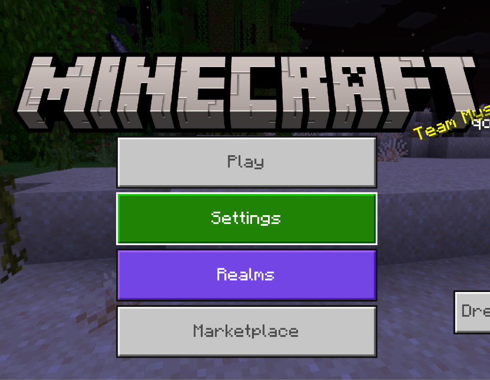
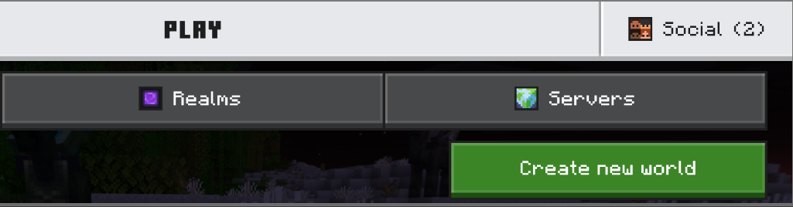
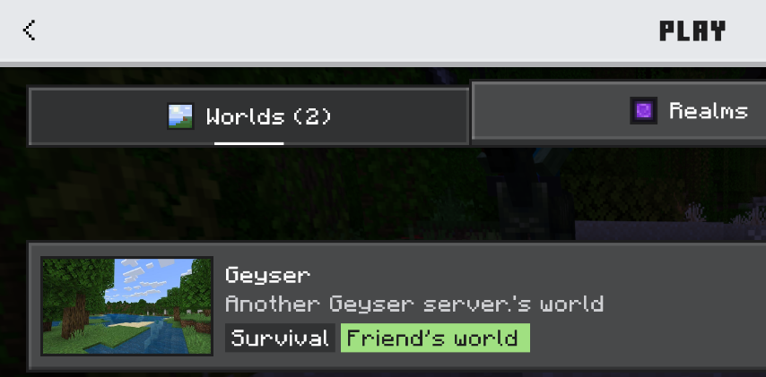

--- 
title: Bedrock Edition - Console
description: Instructions for console players to join the Distinct Errors SMP.
---
import { Steps, Icon, Badge, Aside, LinkCard, CardGrid } from '@astrojs/starlight/components';

Microsoft (without disrespecting them) thought it would be a good idea to not let console players use custom IP addresses. 

***BUT!*** We have a small workaround.

## 1. Launch your game.
Imagine wanting to play without launching the game, that would be pretty crazy, right?



## 2. Click "Play" then "Social"



## 3. Add a friend.
You may request this account as a friend.
```txt
DistErrSMP
```
Once you are accepted, you will be able to join the server by the “Worlds” tab.



<Aside type="danger" title="This is very early!">
    The workaround has been tested and works. We are still working on displaying the right infos on it. 
    
    So don't fret if the Friend's world isn't named "Distinct Errors SMP" for now, it's still a WIP.
</Aside>

## Don't forget to register!

Once you join the server for the first time, you will be asked to do the command `/register <password>`.

Since the server is allowed to cracked version, anyone can choose the nickname they want. We have decided to add a password system to counter unwanted login from strangers.

Once you log in, decide a strong password between 6–18 characters.

<CardGrid>
    <LinkCard
        title="Origins"
        href="/guides/origins/"
        description="You arrive in a world... That lets you mutate?"
    />
    <LinkCard
        title="You're on PC or mobile?"
        href=""
        description="Go to the guide for PC and mobile players."
    />
    <LinkCard
        title="Having trouble connecting?"
        href="/guides/troubleshooting/"
        description="A guide to help you troubleshoot common connection issues."
    />
</CardGrid>