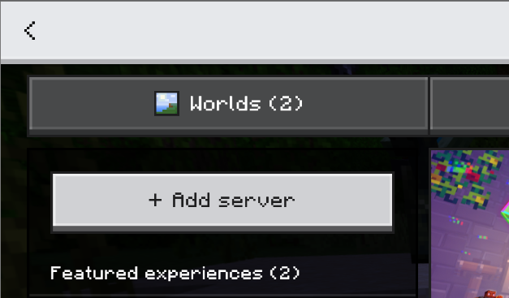
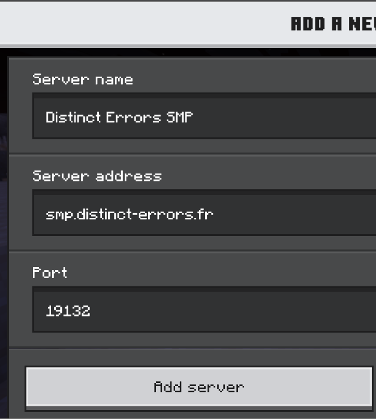

--- 
title: Bedrock Edition - PC and Mobile
description: Instructions for PC and Mobile players to join the Distinct Errors SMP.
---
import { Steps, Icon, Badge, Aside, LinkCard, CardGrid } from '@astrojs/starlight/components';

## 1. Launch your game.
Imagine wanting to play without launching the game, that would be pretty crazy, right?


## 2. Click "Play" then "Servers"


## 3. Once in this, "Add server"



This should bring you here!



You can enter any **server name** you want, as it is mainly used for you to stay organized.
You need to enter the following string into **Server Address**: 

```txt
smp.distinct-errors.fr
```

And you must ***KEEP*** the port as:

```txt
19132
```

## 4. Click "Add server" and voilà! 🎊

## 5. Don't forget to register!

Once you join the server for the first time, you will be asked to do the command `/register <password>`.

Since the server is allowed to cracked version, anyone can choose the nickname they want. We have decided to add a password system to counter unwanted login from strangers.

Once you log in, decide a strong password between 6–18 characters.

<CardGrid>
    <LinkCard
        title="Origins"
        href="/guides/origins/"
        description="You arrive in a world... That lets you mutate?"
    />
    <LinkCard
        title="You're on console?"
        href="/guides/getting-started/bedrock/console/"
        description="Go to the guide for console players."
    />
    <LinkCard
        title="Having trouble connecting?"
        href="/guides/troubleshooting/"
        description="A guide to help you troubleshoot common connection issues."
    />
</CardGrid>