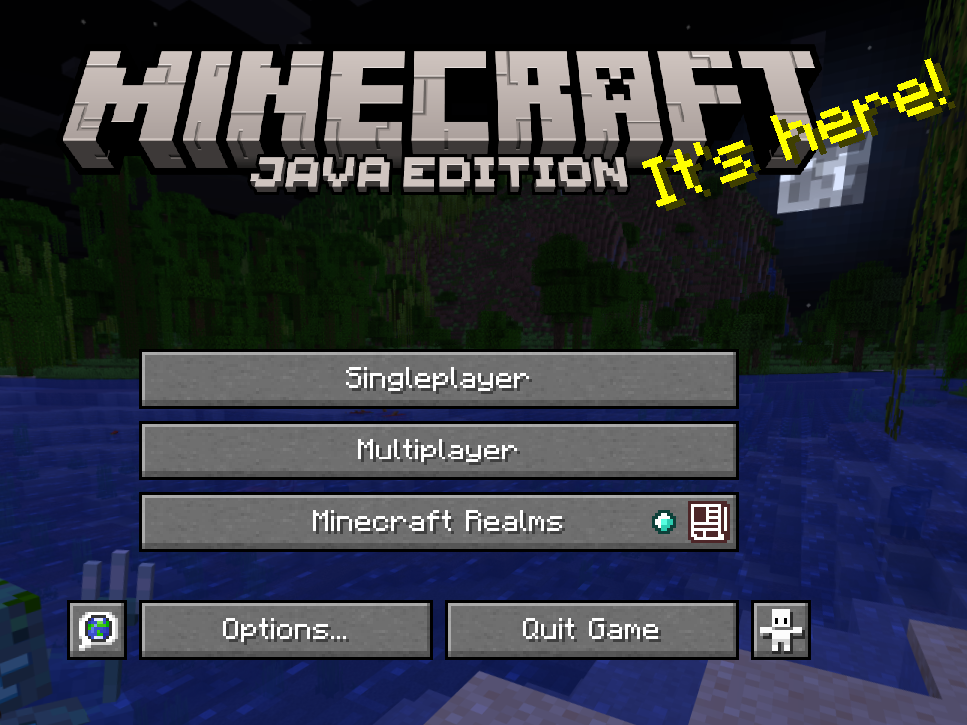
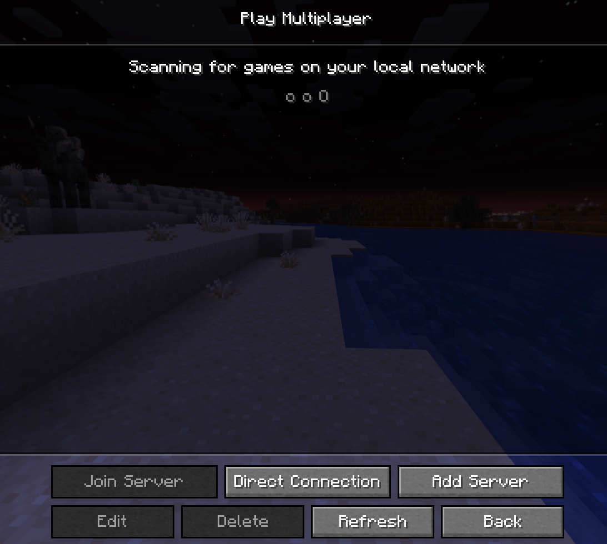
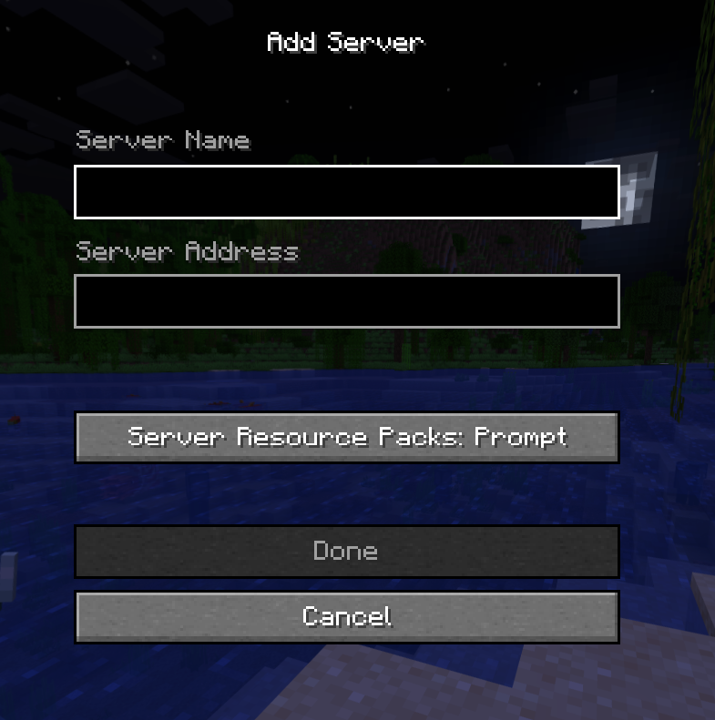
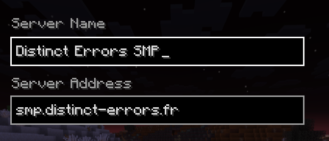
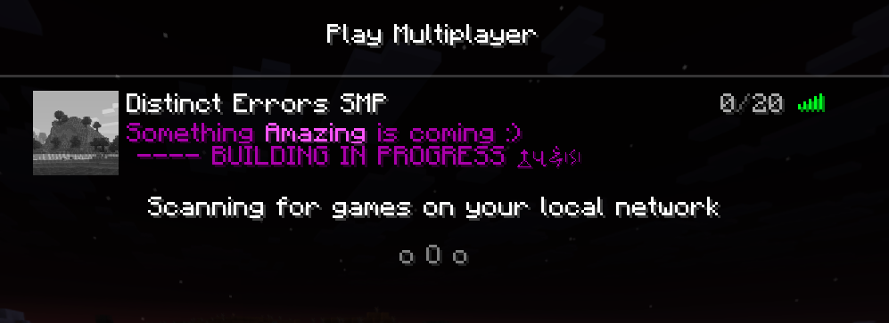

import { Steps, Icon, Badge, Aside, LinkCard, CardGrid } from '@astrojs/starlight/components';

Connecting using the Java edition is easy!

<Aside type="caution" title="Which launcher should I use?">
    Many notes to begin with:
    
    ***For Cracked users:*** It is very hard to find a good cracked launcher that doesn't have a bad reputation online.
    
    One of the most popular ones is [TLauncher](https://tlauncher.org/), but it has a bad reputation for being a source of malware, and many antivirus programs flag it as such.
    If you choose to use TLauncher, make sure to download it from the official website, and be cautious of any pop-ups or ads that may appear during the installation process.
    
    ***For Premium users:*** You can use the official Minecraft Launcher if you wish to, but i personally recommend [Prism Launcher](https://prismlauncher.org/) as it has a lot of features and is very user-friendly, or [Modrinth launcher](https://modrinth.com/app) if you want a more lightweight launcher that is focused on modding.
    
    (for cracked users, there is also a version of Prism Launcher that supports cracked accounts, but it is not officially supported by the developers, so use it at your own risk.)
</Aside>

## 1. Launch your game.
Imagine wanting to play without launching the game, that would be pretty crazy, right?



## 2. Click "Multiplayer"
This menu should appear!



## 3. "Add server"
When clicked, it brings you here!



You can enter any **server name** you want, as it is mainly used for you to stay organized.
You need to enter the following string into **Server Address**: 

```txt
smp.distinct-errors.fr
```

Is advised for **Server Resources Packs** to stay in "*Prompt*" or "*Enabled*". 



## 4. Click "Done" and voila! 🎊


## 5. Don't forget to register!

Once you join the server for the first time, you will be asked to do the command `/register <password>`.

Since the server is allowed to cracked version, anyone can choose the nickname they want. We have decided to add a password system to counter unwanted login from strangers.

Once you log in, decide a strong password between 6–18 characters.

<CardGrid>
    <LinkCard
        title="Origins"
        href="/guides/origins/"
        description="You arrive in a world... That lets you mutate?"
    />
    <LinkCard
        title="Having trouble connecting?"
        href="/guides/troubleshooting/"
        description="A guide to help you troubleshoot common connection issues."
    />
</CardGrid>