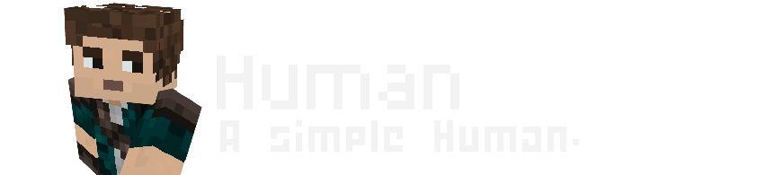
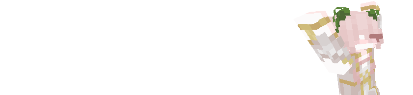
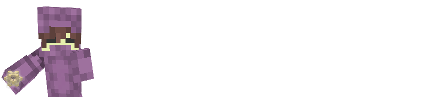

import { Steps, Icon, Badge, Aside, LinkCard, CardGrid } from '@astrojs/starlight/components';
import Sword from '~icons/ph/sword'

{/* --------------------------------- */}

{/*
<h2 style="display: flex; align-items: center; gap: 1rem;">
  <Sword color="goldenrod" style="font-size: 1.5em; flex-shrink: 0;" aria-hidden />
  Swords & Combat
</h2>
*/}

> *" Yet one thing for sure, whatever corruption lies here—you are one of them. "*
> - Distinct Errors, Lore 001


Every players has to choose an mutation. 
In Distinct Errors SMP, we are using the plugin version of Origins, which leads to the GUI not being the best for you to choose. 
So to avoid you wasting time, we will explain you here all origins present in the mod (without passing through Fandom and their 2093 ADs)

Here is a list of all the Mutations you can choose from, with a little description of their powers and weaknesses.

# Table of Contents
<CardGrid>
    <LinkCard
        title="Human"
        href="#human"
    />
    <LinkCard
        title="Avian"
        href="#avian"
    />
    <LinkCard
        title="Arachnid"
        href="#arachnid"
    />
    <LinkCard
        title="Elytrian"
        href="#elytrian"
    />
    <LinkCard
        title="Shulk"
        href="#shulk"
    />
</CardGrid>

---
## Human 

> ***A regular human. Your ordinary Minecraft experience awaits.***



A complete vanilla, powerless experience.

### Powers :

There's nothing more to say.

### Tips :
- . . . Play the game like you would normally do, but be careful, you are more vulnerable than the others.

---

## Avian 

> ***The Avian race has lost their ability to fly a long time ago. Now these peaceful creatures can be seen gliding from one place to another.***



## Powers :

### **Featherweight**
> You fall as gently to the ground as a feather would, unless you sneak.
### **Fresh air**
> When sleeping, your bed needs to be at an altitude of at least **86 blocks**, so you can breathe fresh air.
### **Tailwind**
> You are a **little bit quicker** on foot than others. 
### **Oviparous**
> Whenever you wake up in the morning, you will **lay an** ***egg***.
### **Vegetarian**
>You **can't digest** any meat.

<Aside type="note" title="Clarifications about eating other foods:"> 
    Any other types of food than vegetables will provide you no *Saturation* and *Will poison you*.
</Aside>

## Powers recap : 
```diff
+ Permanant Feather Falling effect (unless sneaking)
+ Permanant small Speed effect
+ Spawns an egg everytime you sleep
- Must sleep at Y 86
- Not able to eat meat
```

---

## Arachnid


## Powers :

### **Climbing**
> *You are able to climp up any kind of wall, not just ladders.*

### **Master of webs**
> *You navigate cobwebs perfectly, and are able to climb in them.*

> *When you hit an enemy in melee, they get stuck in cobweb for a while.*

> *Non-arthropods stuck in cobweb will be sensed by you.*

> *You are able to craft cobweb from strings.*

### **Carnivore**
> *Your diet is restricted t meat, you can't eat vegetables.*

<Aside type="note" title="Clarifications about eating other foods:"> 
    Any other types of food than meat will provide you no *Saturation* and *Will poison you*.
</Aside>

### **Fragile**
> *You have 3 less heart of health than humans. (7 hearts instead of 10.)*

## Powers recap : 
```diff
+ Able to climb walls*
+ 100% movement accuracy in cobweb
+ Stuck enemies in cobwebs when hit
+ Feels neaby players stuck in cobwebs
+ Craft cobwebs with strings unblocked
- Not able to eat vegetables
- -30% Health
```

---

## Elytrian

> ***Often flying around in the winds, Elytrians are uncomfortable when they don't have enough space above their head.***


## Powers :

### **Winged:** 
> *You have Elytra wings without needing to equip any.*

### **Gift of the Winds**
> *Every* ***30*** *seconds, you are able to launch about 20 blocks up into the air.*

### **Aerial Combatant**
> *You deal substantially more damage while in Elytra flight.*

### **Need for Mobility** 
> *You can not wear any heavy armor (armor with protection values higher than chainmail).*

> ✅ **Leather, Gold, Chainmail**

> ❌ **Copper, Iron, Diamond, Netherite**

### **Claustrophobia** 
> *Being somewhere with a low ceiling for too long will weaken you and make you slower.*

### **Brittle Bones** 
> *You take more damage from falling and flying into blocks.*

## Powers recap : 

```diff
+ Permanant elytra equipped
+ ~20 jump every 30 seconds
+ +50% damage when gliding
- Can only wear light armor
- Slowness and Weakness Debuff when low-ceiling environnements
- +50% kinetics damage
```

---

## Shulk 

> ***Related to Shulkers, the bodies of the Shulk are outfitted with a protective shell-like skin.***



## Powers :

### **Hoarder**
>You have access to an additional 9 slots of inventory, which keep the items on death.

### **Sturdy Skin**
> Even without wearing armor, your skin provides natural protection

### **Strong Arms** 
> You are stronger and can break natural blocks without requiring any pickaxe.

### **Unwieldy** 
> The way your hands are formed provide no way of holding a shield upright.

### **Large appetite**
> You exhaust much quicker than others, thus requiring you to eat more.

## Powers recap :
```diff
+ +9 deathproof inventory slots
+ +20% natural protection against all harm sources
+ Pickaxe not required to break blocks.
- No shield
- +25% hunger
```

---
