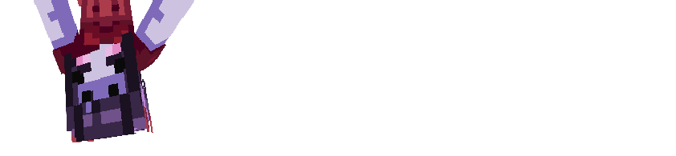

import { Steps, Icon, Badge, Aside, LinkCard, CardGrid } from '@astrojs/starlight/components';

## Arachnid



## Powers :

### **Climbing**
> *You are able to climp up any kind of wall, not just ladders.*

### **Master of webs**
> *You navigate cobwebs perfectly, and are able to climb in them.*

> *When you hit an enemy in melee, they get stuck in cobweb for a while.*

> *Non-arthropods stuck in cobweb will be sensed by you.*

> *You are able to craft cobweb from strings.*

### **Carnivore**
> *Your diet is restricted t meat, you can't eat vegetables.*

<Aside type="note" title="Clarifications about eating other foods:"> 
    Any other types of food than meat will provide you no *Saturation* and *Will poison you*.
</Aside>

### **Fragile**
> *You have 3 less heart of health than humans. (7 hearts instead of 10.)*

## Powers recap : 
```diff
+ Able to climb walls*
+ 100% movement accuracy in cobweb
+ Stuck enemies in cobwebs when hit
+ Feels neaby players stuck in cobwebs
+ Craft cobwebs with strings unblocked
- Not able to eat vegetables
- -30% Health
```