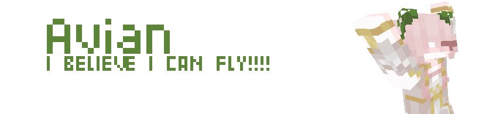

import { Steps, Icon, Badge, Aside, LinkCard, CardGrid } from '@astrojs/starlight/components';

# Avian 

> ***The Avian race has lost their ability to fly a long time ago. Now these peaceful creatures can be seen gliding from one place to another.***



## Powers :

### **Featherweight**
> You fall as gently to the ground as a feather would, unless you sneak.
### **Fresh air**
> When sleeping, your bed needs to be at an altitude of at least **86 blocks**, so you can breathe fresh air.
### **Tailwind**
> You are a **little bit quicker** on foot than others. 
### **Oviparous**
> Whenever you wake up in the morning, you will **lay an** ***egg***.
### **Vegetarian**
>You **can't digest** any meat.

<Aside type="note" title="Clarifications about eating other foods:"> 
    Any other types of food than vegetables will provide you no *Saturation* and *Will poison you*.
</Aside>

## Powers recap : 
```diff
+ Permanant Feather Falling effect (unless sneaking)
+ Permanant small Speed effect
+ Spawns an egg everytime you sleep
- Must sleep at Y 86
- Not able to eat meat
```

## Tips :
- You should make your home on a mountain, so you can sleep.
- Don't ask why you lay eggs... Ask the main modder who made this origin, he is the one who came up with this idea.