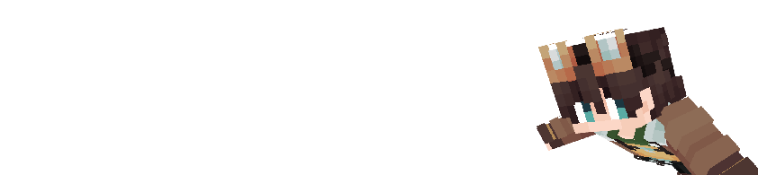

import { Steps, Icon, Badge, Aside, LinkCard, CardGrid } from '@astrojs/starlight/components';

# Elytrian

> ***Often flying around in the winds, Elytrians are uncomfortable when they don't have enough space above their head.***



## Powers :

### **Winged:** 
> *You have Elytra wings without needing to equip any.*

### **Gift of the Winds**
> *Every* ***30*** *seconds, you are able to launch about 20 blocks up into the air.*

### **Aerial Combatant**
> *You deal substantially more damage while in Elytra flight.*

### **Need for Mobility** 
> *You can not wear any heavy armor (armor with protection values higher than chainmail).*

> ✅ **Leather, Gold, Chainmail**

> ❌ **Copper, Iron, Diamond, Netherite**

### **Claustrophobia** 
> *Being somewhere with a low ceiling for too long will weaken you and make you slower.*

### **Brittle Bones** 
> *You take more damage from falling and flying into blocks.*

## Powers recap : 

```diff
+ Permanant elytra equipped
+ ~20 jump every 30 seconds
+ +50% damage when gliding
- Can only wear light armor
- Slowness and Weakness Debuff when low-ceiling environnements
- +50% kinetics damage
```