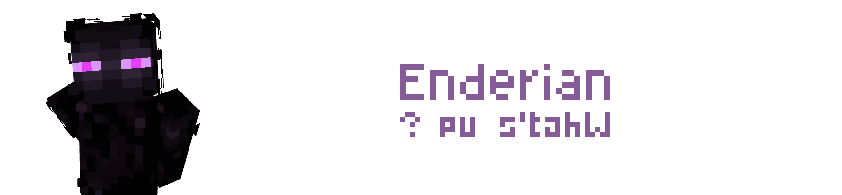

import { Steps, Icon, Badge, Aside, LinkCard, CardGrid } from '@astrojs/starlight/components';

# Enderian

> ***Born as children of the Ender Dragon, Enderians are capable of teleporting but are vulnerable to water.***



## Powers :

### **Teleportation**
> Whenever you want, you may throw an Ender pearl which deals no damage, allowing you to teleport.

> [!note] Clarifications about ***Teleportation*** power:
> - You do not need an Ender pearl to teleport. You must have an empty hand slot.
> - If you use pearls normally, you will somehow ***take damage***.

### **Hydrophobia**
> You receive damage over time while in contact with water.
### **Scared of Gourds**
> You are afraid of pumpkins. For a good reason.
### **Slender body**
> You can reach blocks and entities further away

## Powers recap :
```diff
+ Unlimited, damageless teleportation 
+ +3 blocks range
- Cannot go into water.
- Player wearing pumpkins will be invisible.
```