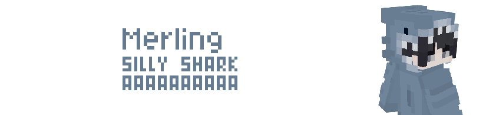

import { Steps, Icon, Badge, Aside, LinkCard, CardGrid } from '@astrojs/starlight/components';

# Merling

> ***Those natural inhabitants of the ocean are not used to being out of the water for too long.***



## Powers :

### **Gills**
> You can breathe underwater, but not on land.

### **Wet Eyes**
> Your vision underwater is perfect.

### **Aqua Affinity**
> You may break blocks underwater as others do on land.

### **Fins**
> Your underwater speed is increased.

### **Like Water**
> When underwater, you do not sink to the ground unless you want to.

## Powers recap :
```diff
+ +100% Movement accurary underwater
+ +100% vision underwater
+ block breaking increased underwater
- Cannot breathe on land 
```