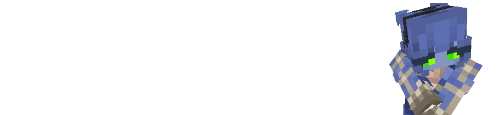

# Phantom

> ***As half-human and half-phantom beings, these creatures can switch between a Phantom and a normal form.***



## Powers :

### **Phasing**
> While phantomized, you can walk through solid material, except Obsidian.
### **Invisibility**
> While phantomized, you are invisible.
### **Photoallergic**
> You begin to burn in daylight if you are not invisible.
### **Fast Metabolism**
> Being phantomized causes you to become hungry.
### **Fragile**
> You have 3 less hearts of health than humans.

## Powers recap :
```diff
+ While phantomized:
+ You are invisible.
+ You can pass through solid blocks. (obsidian exempted)
+ immune to daylight damage.
- Hunger effect applies.
- -30% health
```